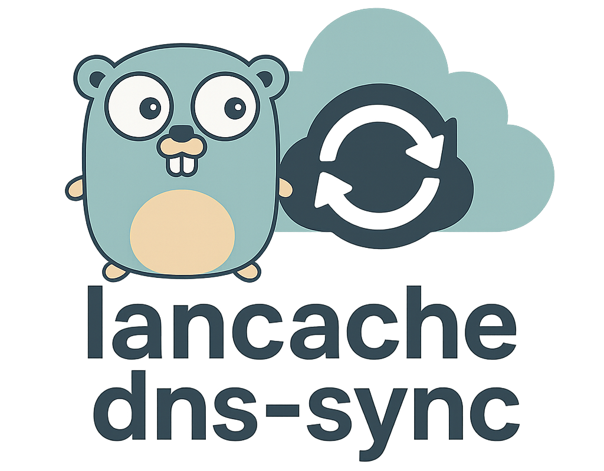

<div align="center">

<picture>
  <source media="(prefers-color-scheme: dark)" srcset=".github/img/logo-dark.png">
  
</picture>

[](https://github.com/Skaronator/lancache-dns-sync/actions/workflows/build.yml)
[](https://github.com/Skaronator/lancache-dns-sync/actions/workflows/codeql.yml)
[](https://github.com/Skaronator/lancache-dns-sync/releases/latest)
[](https://github.com/Skaronator/lancache-dns-sync/blob/main/go.mod)

</div>

# Lancache DNS Sync

Lancache DNS Sync is a synchronization tool designed to update DNS entries for specific services for the [LanCache server](https://github.com/lancachenet/monolithic) as rewrites to the [AdGuardHome DNS server](https://github.com/AdguardTeam/AdGuardHome).

It serves users who already have a running local DNS server (AdGuard Home) in their LAN and wish to avoid replacing it with the lancache-dns container.
This project simplifies the integration of lancache server benefits while keeping your existing AdGuard Home setup.

## Table of Contents

- [Lancache DNS Sync](#lancache-dns-sync)
  - [Table of Contents](#table-of-contents)
  - [Installation and Configuration](#installation-and-configuration)
    - [Requirements](#requirements)
    - [Setup](#setup)
      - [Environment Variables](#environment-variables)
      - [Option 1: Docker Compose](#option-1-docker-compose)
      - [Option 2: Without Docker](#option-2-without-docker)
    - [How It Works](#how-it-works)
  - [Contributing](#contributing)
  - [License](#license)

## Installation and Configuration

### Requirements

- An existing [AdGuard Home](https://github.com/AdguardTeam/AdGuardHome) setup within your LAN
- An existing [LanCache](https://lancache.net) setup within your lan

### Setup

You can set up Lancache DNS Sync either with Docker Compose or without Docker by running the standalone binary. Both options use the same environment variables listed below.

#### Environment Variables

| Variable         | Description                                    | Required | Default | Example                                                                      |
|------------------|------------------------------------------------|----------|---------|------------------------------------------------------------------------------|
| ADGUARD_USERNAME | Username for AdGuard Home                      | Yes      |         | `ADGUARD_USERNAME=admin`                                                     |
| ADGUARD_PASSWORD | Password for AdGuard Home                      | Yes      |         | `ADGUARD_PASSWORD=admin`                                                     |
| LANCACHE_SERVER  | IP address of your lancache server             | Yes      |         | `LANCACHE_SERVER=192.168.1.1`                                                |
| ADGUARD_API      | API URL for AdGuard Home                       | Yes      |         | `ADGUARD_API=http://fw.home:8080`                                            |
| SYNC_INTERVAL    | Duration between syncs (Go duration format)   | No       | `24h`   | `SYNC_INTERVAL="1h"` or `SYNC_INTERVAL="30m"` or `SYNC_INTERVAL="2h30m"`     |
| RUN_ONCE         | Run sync once and exit                         | No       | `false` | `RUN_ONCE="true"` or `RUN_ONCE="1"` or `RUN_ONCE="yes"`                      |
| SERVICE_NAMES    | Services to sync DNS entries for               | Yes      |         | `SERVICE_NAMES='*'` or `SERVICE_NAMES='wsus,epicgames,steam'`                |

Note: Use `SERVICE_NAMES='*'` to sync all services, or specify comma-separated service names.

#### Option 1: Docker Compose

Create a `docker-compose.yml` file:

```yaml
services:
  lancache-dns-sync:
    image: ghcr.io/skaronator/lancache-dns-sync:latest
    container_name: lancache-dns-sync
    restart: unless-stopped
    environment:
      ADGUARD_API: http://adguard.local:3000
      ADGUARD_USERNAME: admin
      ADGUARD_PASSWORD: password
      LANCACHE_SERVER: 192.168.1.100
      SYNC_INTERVAL: 24h
      SERVICE_NAMES: '*'

  # Copied from: https://github.com/lancachenet/docker-compose/tree/master
  lancache:
    image: lancachenet/monolithic:latest
    container_name: lancache
    restart: unless-stopped
    ports:
      - 80:80/tcp
      - 443:443/tcp
    environment:
      CACHE_MAX_AGE: 365d
      CACHE_INDEX_SIZE: 500m
      MIN_FREE_DISK: 100g
      CACHE_DISK_SIZE: 1000g
    volumes:
      - ./cache:/data/cache
      - ./logs:/data/logs
```

Then run:
```bash
docker compose up -d
```

#### Option 2: Without Docker

Run the application directly by downloading the pre-built binary from GitHub releases:

Download and run:

```bash
# Download latest release for Linux (replace with your OS/architecture)
curl -L https://github.com/Skaronator/lancache-dns-sync/releases/latest/download/lancache-dns-sync_Linux_x86_64.tar.gz -o lancache-dns-sync.tar.gz

# Extract the binary
tar -xzf lancache-dns-sync.tar.gz

# Make it executable
chmod +x lancache-dns-sync

# Set environment variables
export ADGUARD_USERNAME="admin"
export ADGUARD_PASSWORD="password"
export LANCACHE_SERVER="192.168.1.100"
export ADGUARD_API="http://adguard.local:3000"
export SERVICE_NAMES="steam,epicgames"
export SYNC_INTERVAL="2h"  # Optional: sync every 2 hours (default is 24h)

# Run the application
./lancache-dns-sync

# Or run once and exit
./lancache-dns-sync -once
# Or using environment variable
RUN_ONCE=true ./lancache-dns-sync
```

### How It Works

Lancache DNS Sync runs the same way whether you start it as a container or as a standalone binary. At a high level:

- Fetches service definitions from the [upstream cache-domains repository](https://github.com/uklans/cache-domains) and selects the domain lists for the services you specify (or all with `*`).
- Downloads the selected domain files concurrently and converts each entry into an AdGuard Home user rule using `$dnsrewrite=NOERROR;A;<LANCACHE_SERVER>`.
- Writes the generated rules to AdGuard Home via its HTTP API, placing them between markers `# lancache-dns-sync start` and `# lancache-dns-sync end` so that any rules outside this section remain untouched.
- Runs once and exits (`--once` or `RUN_ONCE=true`), or continues to run on a schedule controlled by `SYNC_INTERVAL` (default `24h`) when in daemon mode.

This lets you keep using your existing AdGuard Home instance while leveraging Lancache for supported services, without replacing your DNS server.

## Contributing

We welcome contributions! For enhancements or fixes, please submit an issue or pull request on GitHub. Your contributions help improve Lancache DNS Sync for everyone.

## License

This project is available under the [AGPL-3.0 license](LICENSE.md).
